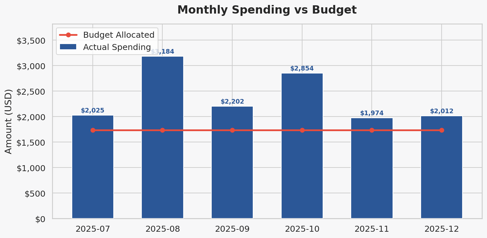
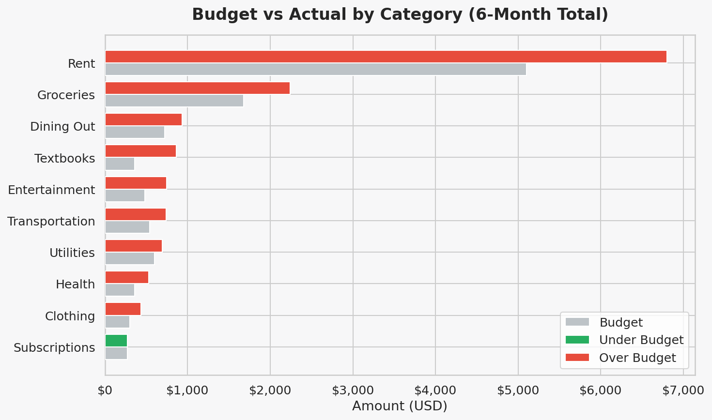
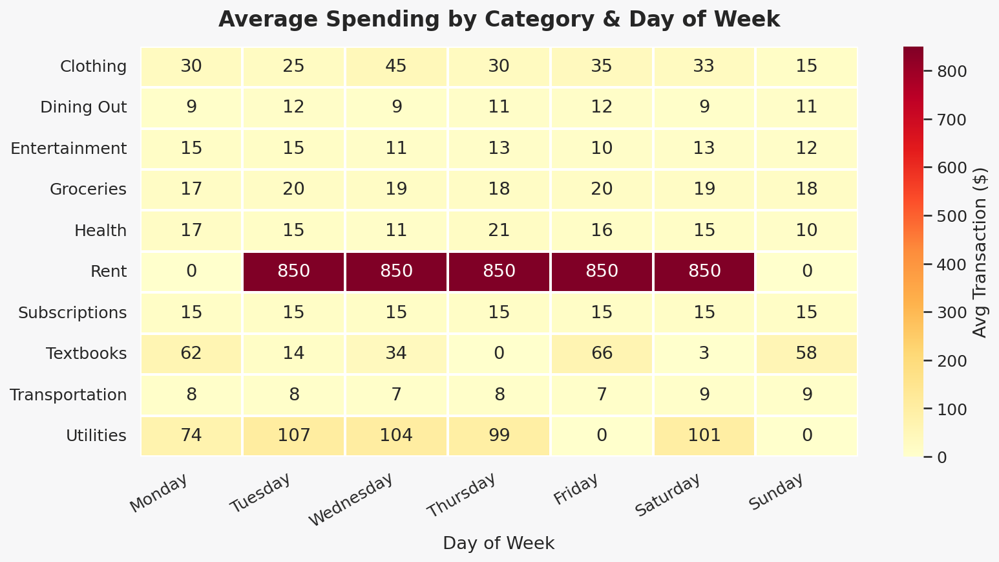
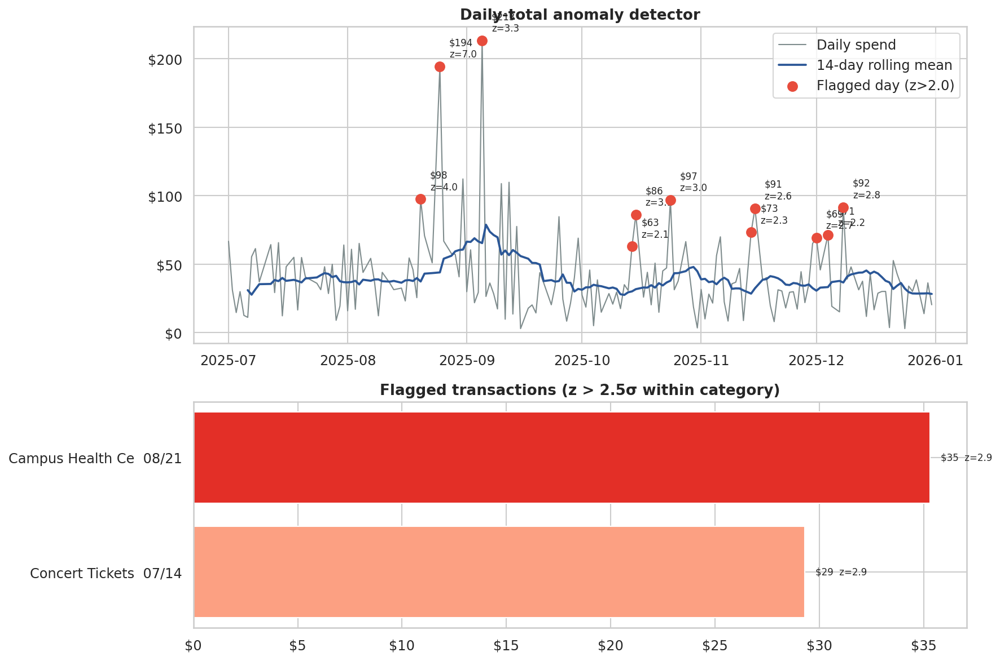
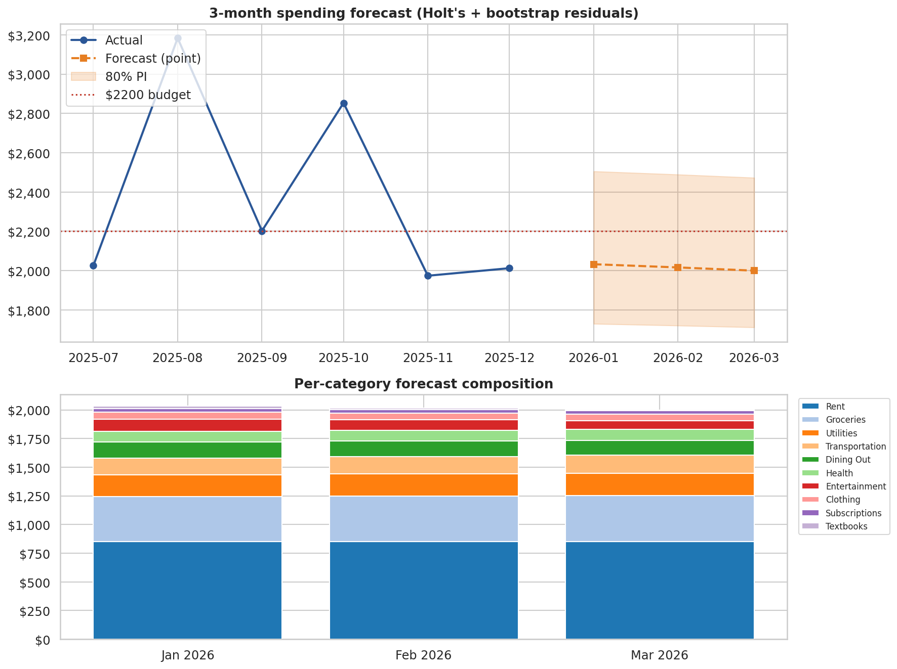

*Monthly spending vs. budget across a 6-month window, with MoM variance arrows.*

# Student Budget Tracker — Power BI

Built this to learn Power BI + DAX. Tracks spending across categories (rent, food, transport, entertainment) over 6 months and pulls out the patterns I wouldn't otherwise notice — which categories blow through budget, which days of the week are expensive, where I'm actually spending vs. where I *think* I'm spending.

## Dashboard pages



The budget-vs-actual view was the one that changed my behavior the most — "Food Delivery" turned out to be ~2x what I had mentally budgeted. The conditional formatting flags any category more than 10% over budget.



Heatmap of spending by day-of-week × category. Friday and Saturday dominate, mostly driven by food and entertainment categories.

## DAX

Wrote 11 custom measures — total spending, monthly burn rate, budget allocated (with SUMMARIZE to dedupe per category), budget variance %, month-over-month change with DATEADD, running totals with DATESYTD, a days-remaining calculation for the burn rate projection. Full list with code and commentary in [`dax_measures.md`](dax_measures.md).

The one that took me the longest was Budget Allocated — the naïve `SUM(budget_allocated)` double-counts because each transaction row carries the monthly budget. Fix was a SUMX over a SUMMARIZE that deduplicates per category per month. Classic DAX gotcha.

## Data

`generate_data.py` produces a synthetic `student_spending.csv` (~6 months of realistic-ish transactions across 8 categories, 4 payment methods, 20-ish vendors). I wasn't going to upload my real bank statements. `analyze.py` is a Python companion that reproduces the core charts in pandas/seaborn for anyone who doesn't have Power BI Desktop.

## Stack

Power BI Desktop, DAX, Python (pandas, matplotlib, seaborn).

## Anomaly detection

After staring at the heatmap for a while I wanted something that would flag weird days *automatically* instead of me eyeballing. `anomaly_detection.py` runs two layered detectors:



A per-transaction detector z-scores each charge against its category's mean (excluding fixed costs like rent), and a daily-total detector compares each day against a 14-day rolling baseline. Threshold is 2.5σ for transactions, 2σ for daily. The concert ticket run and the weekend-cluster spikes show up immediately, which is what you'd want a budgeting tool to catch.

## Forecasting the next 3 months

With 6 months of history, anything fancier than Holt's linear trend would be overfit — but Holt's + bootstrapped residual intervals gives a defensible short-horizon projection.



Fixed-cost categories are held flat at their last-observed value; variable categories get Holt's linear exponential smoothing fit per-category, then the aggregate prediction interval is built from the bootstrap of in-sample residuals. Current projection has me at ~$2,030/month with an 80% band of $1,710–$2,500, which is right at the $2,200 budget line.

## Interactive HTML dashboard

`build_dashboard.py` renders a standalone [`dashboard.html`](dashboard.html) — single file, inlined Plotly JS, no server needed. Four tiles (monthly vs. budget, category donut, weekday × category heatmap, top-10 vendors) plus a payment-method dropdown that re-filters the whole dashboard. The reason this exists is that the Power BI `.pbix` is gone (see below) and an HTML file is the next best thing — anyone can open it.

## Note on the .pbix

The original Power BI Desktop file from when I built this is no longer on my machine (it was lost in a drive cleanup before I pushed this repo). What's here is the reproducible guts — the synthetic data generator, the DAX measure reference, the Python companion that rebuilds the same chart set, and the standalone HTML dashboard. If you want to actually click through the dashboard you can either open `dashboard.html` directly or recreate the visuals in Power BI from the measures in [`dax_measures.md`](dax_measures.md); the `screenshots/` folder shows how the final pages looked.

## Run

```bash
pip install -r requirements.txt
python generate_data.py          # writes data/student_spending.csv
python analyze.py                # Python version of the dashboard
python anomaly_detection.py      # flags unusual days + transactions
python forecast.py               # 3-month projection with 80% PI
python build_dashboard.py        # writes dashboard.html (standalone)
```

See `screenshots/` for the remaining dashboard pages (payment method breakdown, top vendors, category donut, burn rate projection).
