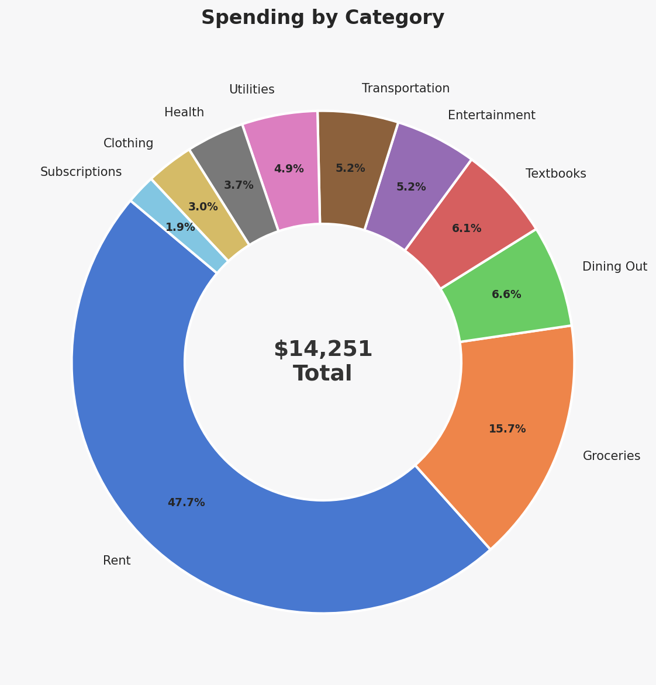
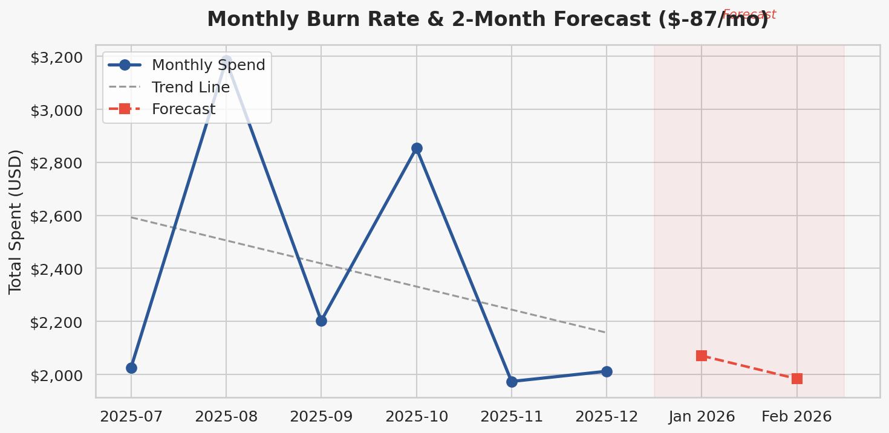
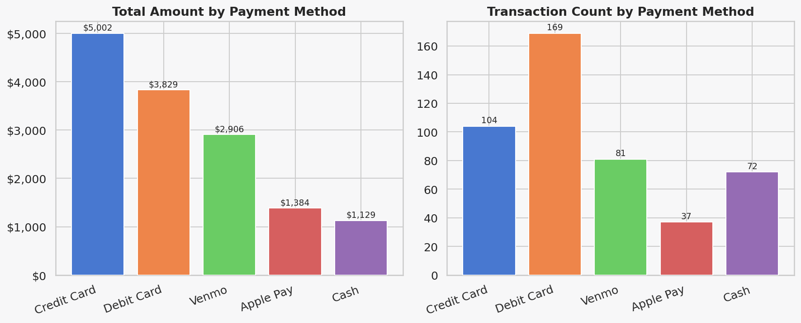
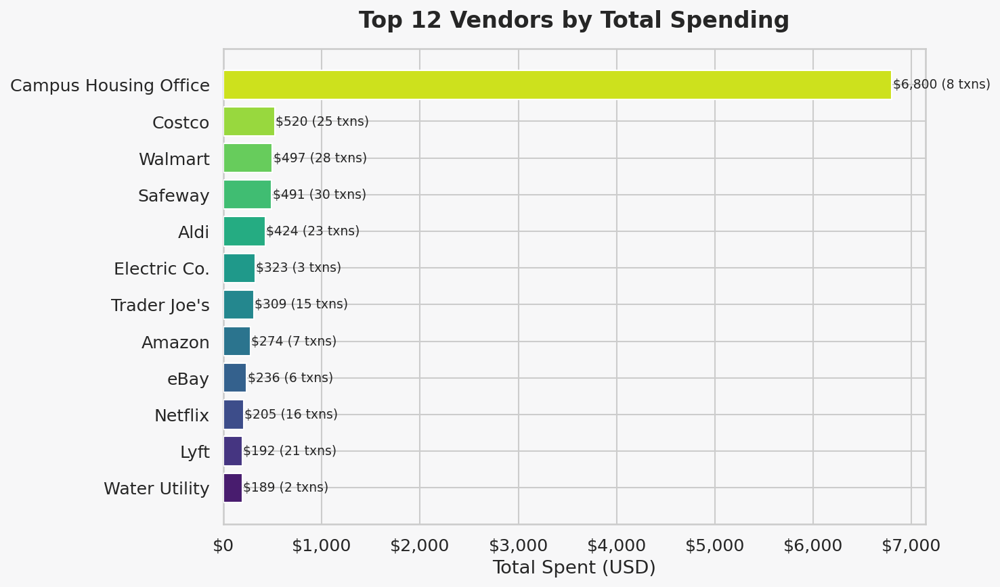

# Student Budget Tracker Dashboard

A Power BI analytics dashboard for tracking and visualizing student spending habits over a 6-month period. Built with synthetic transaction data, 11 DAX measures, and Python-generated companion visualizations.

**Tools:** Power BI Desktop, Python (pandas, matplotlib, seaborn), DAX

---

## Dashboard Overview

This project analyzes ~500 student transactions across 10 spending categories (July--December 2025) to answer:

- Where does the money actually go each month?
- Which categories consistently exceed their budget?
- What is the monthly burn rate, and where is it trending?
- How do spending patterns vary by day of week and payment method?

### Key Metrics (KPI Cards)

| Metric | Value |
|--------|-------|
| Total Spending | Calculated via `SUM(amount)` |
| Monthly Burn Rate | Avg monthly expenditure |
| Budget Variance % | Over/under budget indicator |
| Days Until Budget Exceeded | Gauge based on daily run rate |

---

## Visualizations

### 1. Monthly Spending vs Budget
Bar chart comparing actual spend to allocated budget by month, with trend annotations.


### 2. Spending by Category
Donut chart showing proportional breakdown across all 10 categories.



### 3. Budget vs Actual by Category
Horizontal grouped bar chart with red/green conditional coloring for over/under budget.


### 4. Spending Heatmap
Category-by-day-of-week heatmap showing average transaction size patterns.


### 5. Burn Rate & 2-Month Forecast
Line chart with linear trend projection into the next two months.



### 6. Payment Method Distribution
Dual bar charts: total amount and transaction count by payment method.



### 7. Top Vendors
Horizontal bar chart ranking the top 12 vendors by total spend.



---

## DAX Measures

This dashboard uses 11 custom DAX measures. Full formulas are documented in [`dax_measures.md`](dax_measures.md).

| # | Measure | Purpose |
|---|---------|---------|
| 1 | Total Spending | Base aggregation |
| 2 | Monthly Burn Rate | Average monthly expenditure |
| 3 | Budget Allocated | De-duplicated budget sum |
| 4 | Budget Variance | Over/under budget (absolute) |
| 5 | Budget Variance % | Over/under budget (relative) |
| 6 | MoM Spending Change | Month-over-month % change |
| 7 | Cumulative Spending | Running total for area charts |
| 8 | Category Share % | Donut chart label driver |
| 9 | Avg Transaction | Mean transaction value |
| 10 | Spending Forecast | Linear 2-month projection |
| 11 | Days Until Budget Exceeded | Run-rate gauge calculation |

---

## Project Structure

```
powerbi-budget-dashboard/
├── README.md               # This file
├── generate_data.py        # Synthetic data generator (~500 transactions)
├── analyze.py              # matplotlib/seaborn visualizations
├── dax_measures.md         # All 11 DAX formulas with explanations
├── data/
│   └── student_spending.csv    # 6-month transaction dataset
└── screenshots/            # Chart PNGs generated by analyze.py
```

---

## Setup & Reproduction

### Prerequisites

- Python 3.10+
- Power BI Desktop (Windows) — for the `.pbix` dashboard

### Generate Data & Charts

```bash
# Create virtual environment (or use an existing one)
python -m venv .venv
source .venv/bin/activate
pip install pandas matplotlib seaborn

# Generate the synthetic dataset
python generate_data.py

# Create all visualization PNGs
python analyze.py
```

### Import into Power BI

1. Open Power BI Desktop
2. **Get Data** > **Text/CSV** > select `data/student_spending.csv`
3. In the Power Query Editor, set `date` column type to **Date** and `amount` to **Decimal Number**
4. Create a date table: **Modeling** > **New Table** > `Date = CALENDARAUTO()`
5. Create a relationship: `student_spending[date]` -> `Date[Date]`
6. Add each DAX measure from [`dax_measures.md`](dax_measures.md) via **New Measure**
7. Build visuals matching the chart descriptions above

---

## Dataset Schema

| Column | Type | Description |
|--------|------|-------------|
| `transaction_id` | string | Unique ID (TXN-0001 format) |
| `date` | date | Transaction date (2025-07-01 to 2025-12-31) |
| `category` | string | One of 10 spending categories |
| `vendor` | string | Store or service name |
| `amount` | float | Transaction amount in USD |
| `payment_method` | string | Debit Card, Credit Card, Cash, Venmo, or Apple Pay |
| `budget_allocated` | float | Monthly budget for that category |

### Spending Categories

| Category | Monthly Budget | Description |
|----------|---------------|-------------|
| Rent | $850 | Campus housing |
| Groceries | $280 | Supermarket trips |
| Dining Out | $120 | Restaurants and cafes |
| Utilities | $100 | Electric, internet, water |
| Transportation | $90 | Rideshare, transit, gas |
| Entertainment | $80 | Movies, games, streaming |
| Health | $60 | Pharmacy, health center |
| Textbooks | $60 | Course materials (seasonal) |
| Clothing | $50 | Apparel purchases |
| Subscriptions | $45 | Digital services |

**Total Monthly Budget: $1,735**

---

## Author

**Ali Askari** — [github.com/awpdemon](https://github.com/awpdemon)
